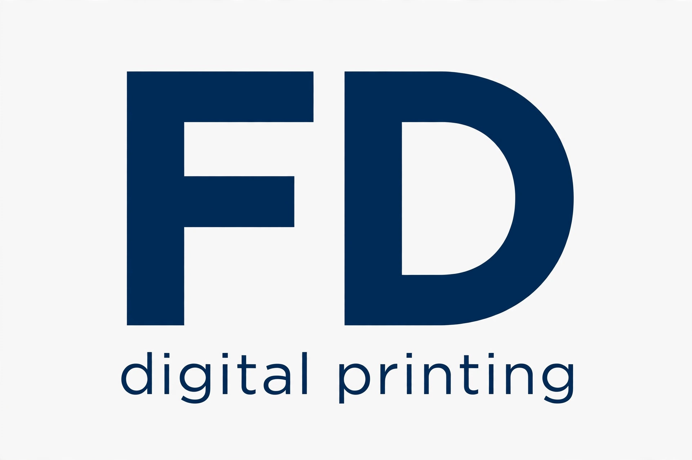

# FD Digital Printing



Sistem operasional digital printing: kasir + manajemen order + piutang.
Stack: **Bun + SvelteKit + Svelte 5 (runes) + Tailwind v4 + Drizzle + SQLite**.

> Nama folder sementara — ganti setelah nama brand diputus.

## Prasyarat

- [Bun](https://bun.sh) >= 1.4 (`/opt/hatch-image/bin/bun` di sandbox ini)

## Jalanin

```bash
bun install
bun run dev        # http://localhost:5173
```

## Database

SQLite via `bun:sqlite` (tanpa dependensi native). Skema di
`src/lib/server/db/schema.ts`:

| Tabel | Isi |
|---|---|
| `customers` | data pelanggan |
| `orders` | order cetakan: `baru → diproses → selesai → diambil` |
| `payments` | tiap pembayaran tercatat sekali (cash/transfer/qris/piutang) — sumber kebenaran omzet |
| `receivables` | piutang: termin & kredit offline. Lunas = status berubah, **bukan dihapus** |

Migrasi:

```bash
bun x drizzle-kit push        # sinkron skema → data/app.db
bun x drizzle-kit studio      # GUI database (opsional)
```

## Struktur

```
src/
  routes/            # halaman SvelteKit
  lib/
    server/db/       # drizzle client + schema (server-only)
  app.css            # Tailwind v4
drizzle/             # snapshot migrasi
data/app.db          # SQLite lokal (jangan di-commit kalau sudah ada data real)
```

## Roadmap modul

1. Kasir + pencatatan pembayaran + laporan omzet harian
2. Order pipeline + WA otomatis "cetakan selesai"
3. Buku piutang + WA reminder jatuh tempo
4. Form order web pelanggan (upload file) → masuk antrian kasir
